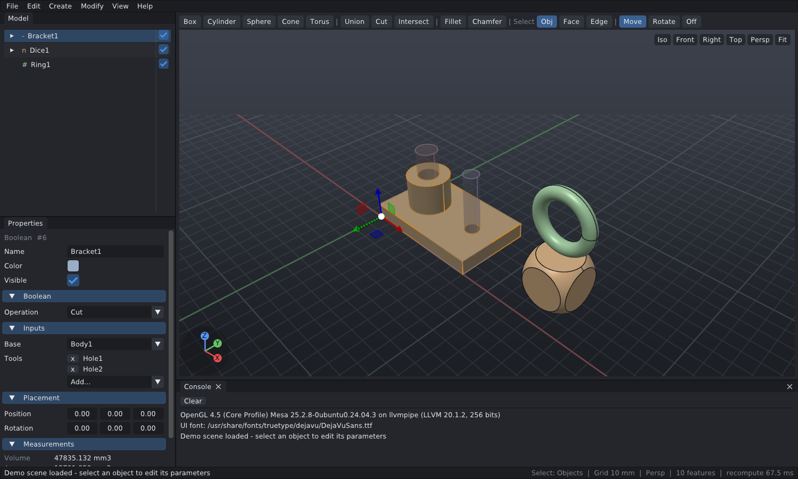
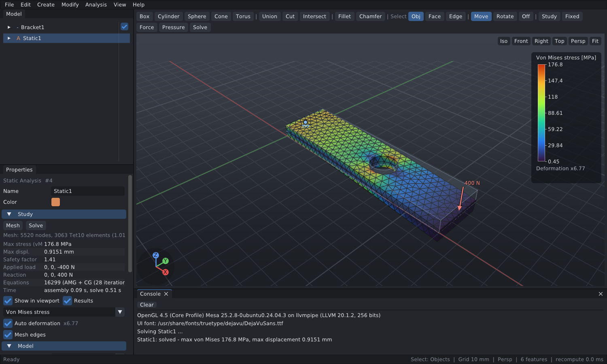
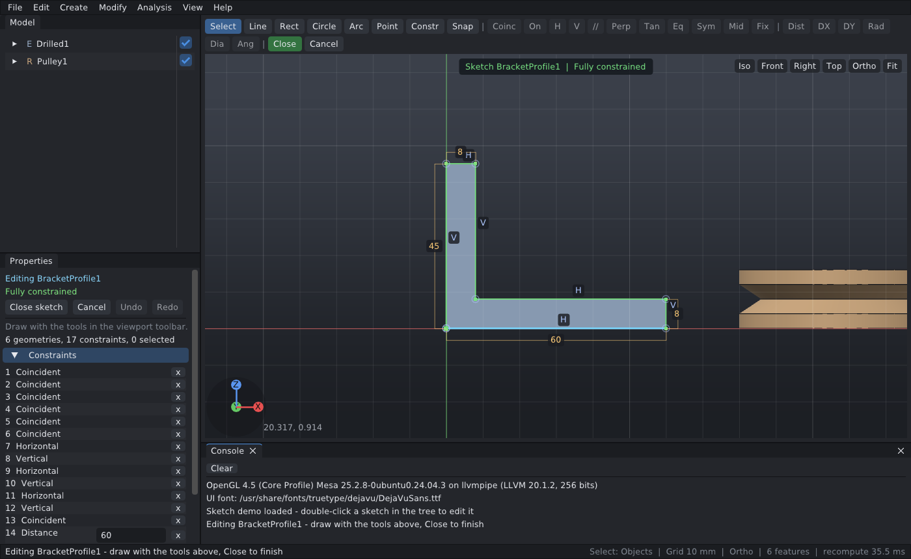

# CadForge

A parametric 3D CAD desktop application in modern C++20.

* **Geometry kernel:** OpenCASCADE (B-Rep): primitives, booleans (CSG), fillet, chamfer, STEP/STL
* **Sketcher:** constrained 2D sketches (FreeCAD's PlaneGCS solver) edited in place in the 3D view,
  turned into solids with Extrude / Revolve (new body, join, cut, intersect)
* **Rendering:** OpenGL 4.1 core (runs on macOS, Windows and Linux), MSAA, GPU id-buffer picking
* **UI:** Dear ImGui (docking) + GLFW, ImGuizmo transform gizmo
* **Model:** history-based feature tree with dependency-ordered recompute, result caching,
  undo/redo and a readable JSON project format (`.cfp`)
* **FEA:** linear static structural analysis — Netgen tetrahedral meshing (Tet4 / Tet10),
  AMG-preconditioned solver, von Mises / displacement plots





## Features (v0.1)

| Area | What you get |
|---|---|
| Primitives | Box, Cylinder (incl. partial angle), Sphere, Cone/Frustum, Torus |
| Sketcher | Sketches on the XY / XZ / YZ planes (with offset), edited in place: lines/polylines, rectangles, circles, arcs, points, construction geometry; coincident, point-on-object, horizontal, vertical, parallel, perpendicular, tangent, equal, symmetric, midpoint, lock; distance, horizontal/vertical distance, radius, diameter and angle dimensions; automatic constraints while drawing, dragging under constraints, degrees-of-freedom and conflict/redundancy reporting |
| Sketch features | Extrude (length, symmetric, reversed) and Revolve (sketch axis or construction line, angle) of closed profiles incl. holes and islands; result as new body or joined with / cut from / intersected with a target body |
| CSG | Union, Cut, Intersect with any number of tools; inputs are shown as ghosts when the result is selected |
| Dress-up | Fillet and Chamfer on picked edges, edges can be re-picked later ("Edit...") |
| Robust references | Picked faces / edges (fillets, chamfers, FEA supports and loads) follow upstream topology changes via geometric signatures; lost references are reported instead of silently jumping |
| Editing | Property panel generated from feature parameters, live preview while dragging values, move/rotate gizmo (Ctrl = snap) |
| Selection | Objects / faces / edges (keys 1/2/3), hover highlight, multi-select with Ctrl/Shift |
| Files | Save/open `.cfp` (JSON), import STEP, export STEP and STL, drag & drop |
| View | Turntable orbit, pan, zoom-to-cursor, fit, standard views, perspective/orthographic, adaptive grid, axis triad |
| History | Unlimited-ish (200 steps) undo/redo of every change |
| Analysis | Static study per solid, material library (or custom E, ν, ρ, yield), fixed supports (per axis), forces, pressures, gravity; Tet4/Tet10 mesh with adjustable size; background meshing/solving with progress; contour plots of von Mises / displacement with deformed shape, legend, safety factor and reaction check |
| Analysis+ | Modal analysis (natural frequencies, mode shapes, effective mass) with Spectra; local mesh refinement on selected faces; section view through the mesh (X/Y/Z plane, flip); probe tool (hover / click to pin values); VTK export (.vtu) of mesh, displacements, stresses and mode shapes for ParaView |

## Building

All dependencies come from **vcpkg** in manifest mode (`vcpkg.json`), so the same commands work on every
platform. The first configure builds OpenCASCADE once (20-60 minutes); later builds use vcpkg's binary cache.

### Prerequisites

* CMake >= 3.21 and Git
* A C++20 compiler
  * **macOS:** Xcode command line tools (`xcode-select --install`), `brew install cmake`
  * **Windows:** Visual Studio 2022 (Desktop development with C++)
  * **Linux (Ubuntu/Debian):**
    `sudo apt install build-essential cmake git curl zip unzip tar pkg-config autoconf automake libtool
    libx11-dev libxrandr-dev libxinerama-dev libxcursor-dev libxi-dev libgl1-mesa-dev libglu1-mesa-dev
    libxkbcommon-dev libwayland-dev`

### Build & run

```bash
# macOS / Linux
./scripts/bootstrap.sh            # clones + bootstraps vcpkg into external/vcpkg (once)
cmake --preset release            # installs dependencies and configures
cmake --build --preset release
ctest --preset release            # kernel/model unit tests

./build/release/src/app/CadForge --demo                    # Linux
open build/release/src/app/CadForge.app --args --demo      # macOS
```

```powershell
# Windows (PowerShell)
.\scripts\bootstrap.ps1
cmake --preset release
cmake --build --preset release
.\build\release\src\app\Release\CadForge.exe --demo
```

### Without vcpkg

If OpenCASCADE and Netgen are already installed on the system, use the `system` preset (pass
`-DNetgen_DIR=<netgen>/lib/cmake/netgen` if Netgen is not found). Missing small libraries (GLFW,
ImGui, ImGuizmo, glm, nlohmann-json, Eigen) are then downloaded automatically with CMake FetchContent:

```bash
cmake --preset system && cmake --build --preset system
```

After pulling a version that adds dependencies to `vcpkg.json`, simply run `cmake --preset release`
again; vcpkg installs what is missing.

## Using CadForge

| Action | Mouse / key |
|---|---|
| Orbit | Right drag, Alt + Left drag (trackpad), Shift + Middle drag |
| Pan | Middle drag, Shift + Right drag |
| Zoom | Wheel (zooms towards the cursor) |
| Select | Left click, Ctrl/Shift/Cmd + click adds |
| Selection mode | `1` objects, `2` faces, `3` edges |
| Gizmo | `W` move, `E` rotate, `Q` off |
| Booleans | `U` union, `X` cut, `N` intersect (first selected object is the base) |
| Fillet / Chamfer | select edges, then `Shift+F` / `Shift+C` |
| Views | Keypad `0` iso, `1` front, `3` right, `7` top (Ctrl = opposite), `F` fit all, `O` ortho |
| Undo / Redo | `Ctrl+Z` / `Ctrl+Shift+Z` (Cmd on macOS) |
| Solve analysis | `F5` |
| Sketch | toolbar **Sketch** (pick a plane), double-click a sketch to edit; `Enter`/`Esc` closes |
| Sketch tools | `L` line, `R` rectangle (or radius with a circle selected), `C` circle, `A` arc, `P` point, `G` construction |
| Sketch constraints | select geometry, then `H` / `V` / `D` distance / `E` equal / `T` tangent or the toolbar; double-click a dimension to edit it |

### Sketching

1. Press **Sketch** in the toolbar and choose a plane. The view turns to face the plane.
2. Draw with **Line** (click points; click the first point to close, right click / `Esc` ends the
   chain), **Rect**, **Circle**, **Arc** (center, start, end; counter-clockwise) or **Point**. Clicking on an existing
   point or curve adds a coincident / point-on-object constraint; nearly horizontal or vertical lines get an H / V
   constraint.
3. Select points / curves (Ctrl/Shift adds) and apply constraints or dimensions from the toolbar. A new dimension
   asks for its value; double-click it later to change it. Drag geometry to see what is still free. Constraints that
   would over-constrain the sketch are refused; the banner shows the remaining degrees of freedom and turns green
   when the sketch is fully constrained.
4. **Close** the sketch, keep it selected and press **Extrude** or **Revolve** (select a body as well to join to
   it). Change length, operation (new body / join / cut / intersect) and target in the property panel.

### Running an analysis

1. Select a solid and press **Study** (toolbar) — a static analysis appears in the tree.
2. Switch to face selection (`2`), pick the faces to hold and press **Fixed**.
3. Pick the loaded faces and press **Force** or **Pressure**; edit the values in the property panel
   (gravity, material and mesh size are properties of the study).
4. Press **Solve** (`F5`). Results replace the solid in the view; choose the field, deformation scale and
   mesh edges in the study panel. Any later change marks the results as *outdated*.

Set **Type** to *Modal* in the study properties for natural frequencies: supports are used, loads are
ignored; pick a mode in the table to see its shape. **Refine** (toolbar) on selected faces adds a local
element size. The study panel also has the section view, the probe and **Export VTK**.

Units are mm, N, MPa (N/mm²), t/mm³ and mm/s². *File > Load Analysis Demo* sets up and solves a
small cantilever plate.

*File > Load Sketch Demo* builds a bracket and a pulley from sketches.

Command line: `CadForge [project.cfp | part.step] [--demo | --fea-demo | --sketch-demo [--edit-sketch]] [--size WxH] [--screenshot out.ppm --frames N]`

## Project layout

```
src/core     plain data types (math, mesh data, logging)          no OCCT, no GL
src/geom     geometry kernel facade over OpenCASCADE              the only place OCCT is used
src/sketch   2D sketch model + PlaneGCS constraint solver          depends on core only
src/fea      FEA engine: Netgen meshing, Eigen/AMGCL solver, post   depends on core only
src/model    parametric document, features, recompute, undo, I/O  no GL, no UI
src/render   OpenGL 4.1 renderer, camera, picking                 knows meshes, not features
src/app      GLFW + ImGui application, panels, commands
tests        kernel + model unit tests (no framework needed)
third_party  vendored glad (GL 4.1 loader), portable-file-dialogs, AMGCL and Spectra (header-only), PlaneGCS
docs         architecture notes and roadmap (CSG, FEA)
```

See [docs/ARCHITECTURE.md](docs/ARCHITECTURE.md) for the design and how to extend it.

## License notes

OpenCASCADE is LGPL-2.1 with an exception, Netgen is LGPL-2.1, PlaneGCS (from FreeCAD, vendored in
`third_party/planegcs` with its license) is LGPL-2.1+, Eigen and Spectra (vendored, header-only) are MPL-2.0, AMGCL is MIT; Dear ImGui, ImGuizmo, GLFW, glm, nlohmann-json and glad are MIT/zlib-style;
portable-file-dialogs is WTFPL.
